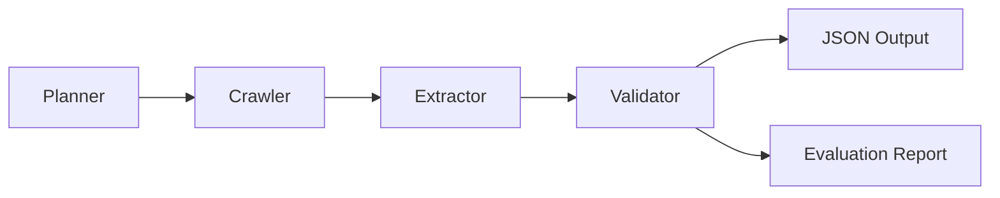

# University Intelligence Database Agent

A simple, modular Python agent that scrapes public university websites and extracts structured intelligence data into JSON files.

## Project Overview

This project collects standardized information from **two universities** (MIT and Stanford) across ten data categories:

- About the university (name, founding year, ranking, location, type)
- Tuition fees (undergraduate and postgraduate)
- Living costs (rent, food, transport)
- Scholarships
- Acceptance rate
- Graduate employment
- Average salaries
- Visa policies
- Intake deadlines
- Course listings

The design prioritizes **readability**, **maintainability**, and **resilience** — not complex agent frameworks.

## Architecture

```
project/
├── data/                  # University URL configuration
├── output/                # Generated JSON + evaluation report
├── scraper/
│   ├── crawler.py         # HTTP fetching with retry/backoff
│   ├── extractor.py       # HTML → structured data parsers
│   ├── validator.py       # Missing/malformed field detection
│   └── planner.py         # Decides which pages to visit
├── models/
│   └── schemas.py         # Dataclass schemas for all fields
├── utils/
│   └── helpers.py         # Shared utilities
├── main.py                # Orchestration entry point
├── requirements.txt
└── README.md
```

### Data Flow



1. **Planner** reads `data/universities.json` and returns URLs grouped by page type (about, fees, scholarships, etc.).
2. **Crawler** fetches each page with timeouts, retries, and exponential backoff.
3. **Extractor** parses HTML with BeautifulSoup and merges results into a `UniversityRecord`.
4. **Validator** checks for missing, empty, or malformed values and records warnings.
5. **main.py** writes per-university JSON, a combined file, and `evaluation_report.md`.

## Setup

Requires **Python 3.10+**.

```bash
# Clone or enter the project directory
cd university-intelligence-agent

# Create and activate a virtual environment (recommended)
python3 -m venv .venv
source .venv/bin/activate   # Windows: .venv\Scripts\activate

# Install dependencies
pip install -r requirements.txt
```

## How to Run

```bash
python main.py
```

The agent will:

1. Plan scrape tasks for MIT and Stanford
2. Fetch each configured page (continuing if individual pages fail)
3. Extract and merge structured data
4. Validate completeness
5. Save results to `output/`

Expected runtime: ~1–3 minutes depending on network speed.

## Output

| File | Description |
|------|-------------|
| `output/mit.json` | Structured MIT data |
| `output/stanford.json` | Structured Stanford data |
| `output/all_universities.json` | Combined results |
| `output/evaluation_report.md` | Completeness and validation summary |

### Example Output (abbreviated)

```json
{
  "about": {
    "name": "Massachusetts Institute of Technology",
    "founding_year": 1861,
    "ranking": "",
    "location": "Cambridge, MA USA",
    "university_type": "Private Research University"
  },
  "tuition_fees": {
    "undergraduate_fees": "$64,730",
    "postgraduate_fees": "$61,990"
  },
  "living_costs": {
    "rent": "$12,000",
    "food": "$6,500",
    "transport": "$1,200"
  },
  "scholarships": [
    {
      "scholarship_name": "MIT Scholarship",
      "value": "$85,236",
      "eligibility": "Need-based aid",
      "deadline": "Varies by academic year"
    }
  ],
  "acceptance_rate": "4.55%",
  "courses": [
    {
      "code": "6.100A",
      "title": "Introduction to Computer Science Programming in Python",
      "credits": "6 units",
      "description": "...",
      "prerequisites": "See course catalog",
      "mode": "In-person"
    }
  ]
}
```

> **Note:** Web scraping results depend on live page content. Some fields may be partially filled; the evaluation report documents gaps and warnings.

## Resilience Features

- **Retry with exponential backoff** on network failures
- **Request timeouts** (20 seconds default)
- **Graceful failure** — if one page fails, others continue
- **Validation warnings** for missing deadlines, fees, or malformed years

## Adding Another University

Edit `data/universities.json` and add a new entry with page URLs:

```json
{
  "slug": "example-uni",
  "name": "Example University",
  "university_type": "Public Research University",
  "pages": {
    "about": "https://...",
    "fees": "https://...",
    "scholarships": "https://...",
    "admissions": "https://...",
    "courses": "https://..."
  }
}
```

Then run `python main.py` again.

## Known Limitations

Some university employment and salary pages are JavaScript-rendered or protected against automated scraping.

The current implementation uses HTTP-based crawling with BeautifulSoup and therefore may not extract data from pages requiring client-side rendering.

The architecture is designed so browser-based crawlers (Playwright/Selenium) can be added later without modifying the extraction pipeline.

## License

Educational take-home project. Respect university website terms of service and robots.txt when scraping.
